## Abstract

In this work we address the problem of 3D human pose forecasting. Given a pose representation, our model, Convolutional Mixer, first applies the convolution in temporal dimension, learning the dependency between the target joint position at previous and future time frames. Then, it performs convolution in pose dimension to assess the relation between adjacent joints. We perform experiments on Human3.6m dataset and evaluate the importance of each parameter of our model.  We also evaluate it on the custom dataset recorded in the AIS lab. Finally, we extend it to perform predictions in an autoregressive fashion, which allows us to perform inference over long time intervals. Our results show that the model performs well on various motion sequences, and generalizes to novel datasets and long predictions.

## Method

## Skeleton Structure

## Results on Human3.6m dataset

<table>
  <tr>
    <td> directions</td>
    <td> discussion</td>
    <td>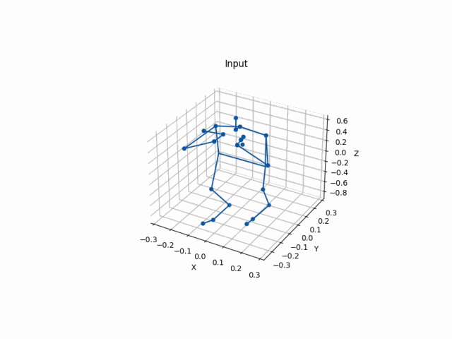 eating</td>
  </tr>
    <tr>
        <td>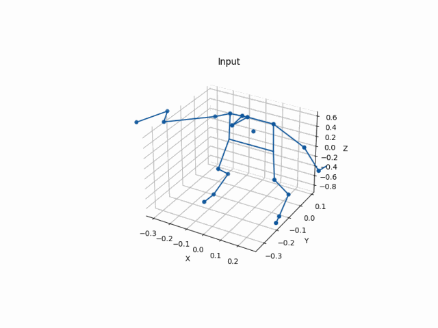 greeting</td>
        <td>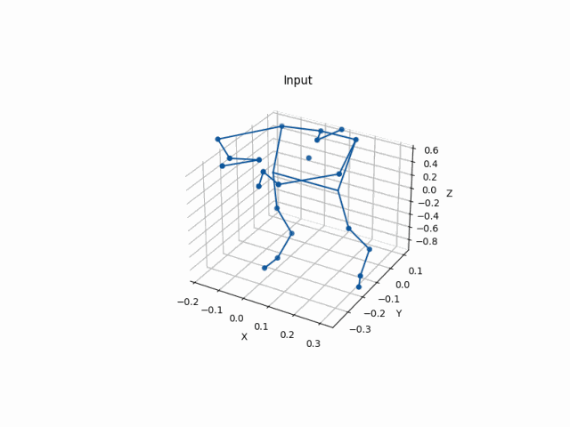 phoning</td>
        <td>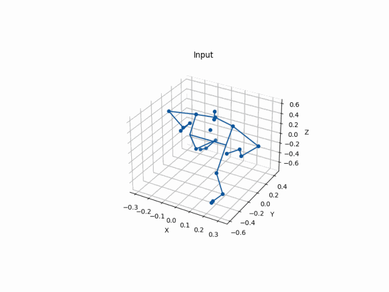 posing</td>
    </tr>
    <tr>
        <td>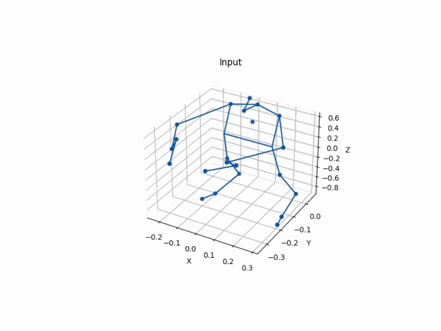 purchases</td>
        <td>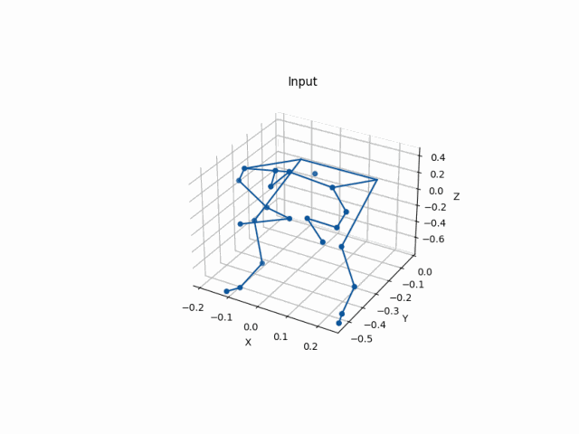 sitting</td>
        <td>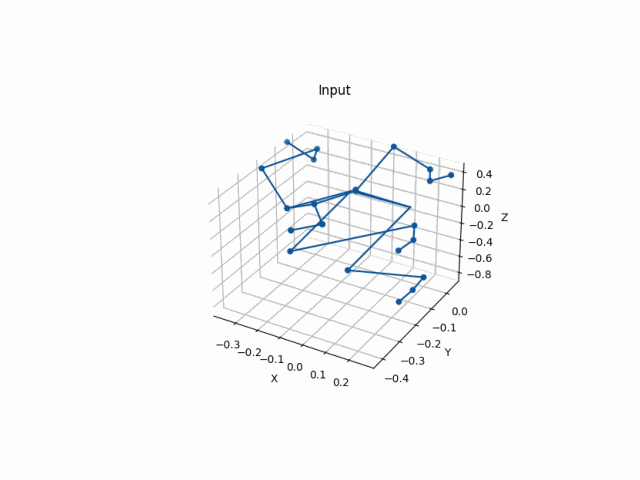 sittingdown</td>
    </tr>
    <tr>
        <td>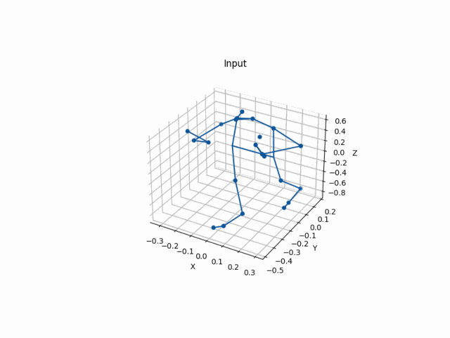 smoking</td>
        <td>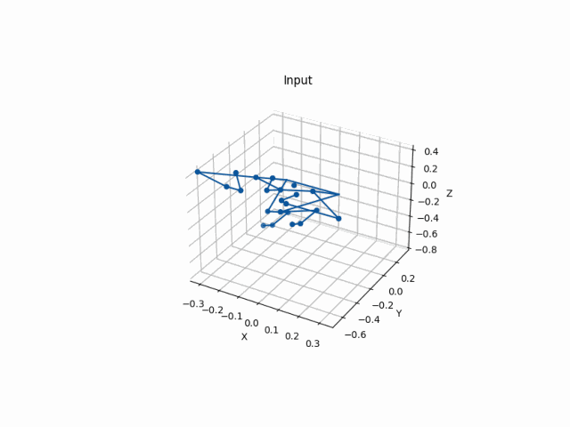 takingphoto</td>
        <td>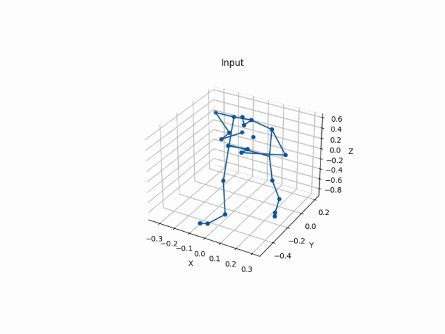 waiting</td>
    </tr>
    <tr>
        <td> walking</td>
        <td>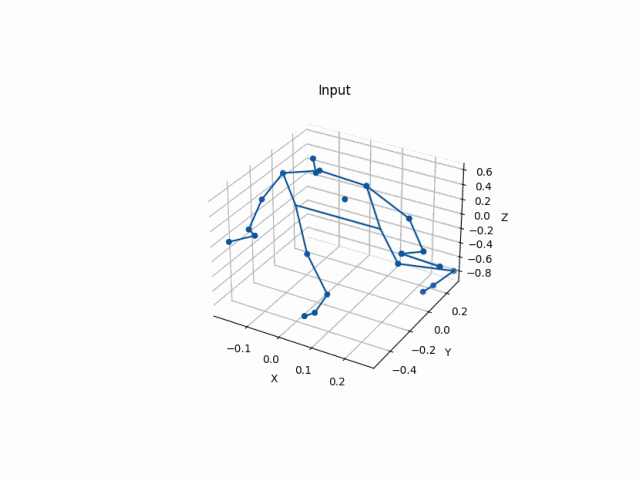 walkingdog</td>
        <td> walkingtogether</td>
    </tr>
</table>

## Results on custom dataset
---
