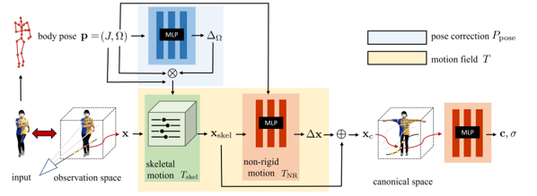
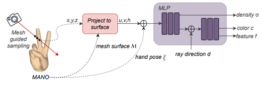
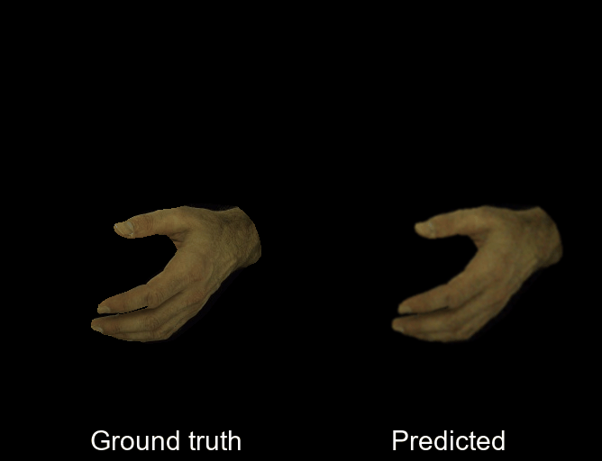
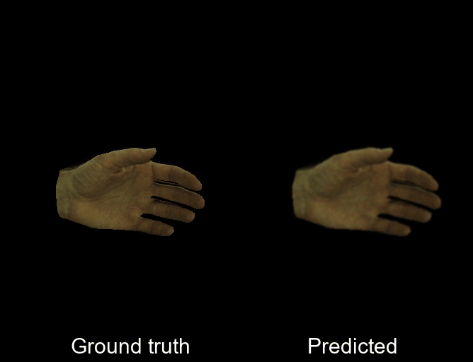

<!-- 

  <b>Aleksei Zhuravlev, [Dr. Danda Pani Paudel](https://people.ee.ethz.ch/~paudeld/), [Dr. Thomas Probst](https://probstt.bitbucket.io/)</b> 
  <b><i>University of Bonn</i></b>

 -->

<!-- 
 -->
[Aleksei Zhuravlev](https://alekseizhuravlev.github.io/), [Dr. Danda Pani Paudel](https://people.ee.ethz.ch/~paudeld/) and [Dr. Thomas Probst](https://probstt.bitbucket.io/)
<!-- 
 -->

<table>
  <tr>
    <td> </td>
    <td> </td>
    </tr>
</table>

## Abstract

 

This work addresses the problem of reconstructing an animatable avatar of a human hand from a collection of images of a user performing a sequence of gestures. Our model can capture accurate hand shape and appearance and generalize to various hand subjects. 
For a 3D point, we can apply two types of warping: zero-pose canonical space and UV space. The encoded coordinates are then passed to a NeRF which outputs the expected color and density. We demonstrate that our model can accurately reconstruct a dynamic hand from monocular or multi-view sequences, achieving high visual quality on Interhand2.6m dataset.

## Method

<!-- <table>
  <tr>
    <td></td>
    <td></td>
  </tr>
</table> -->

- Warping of 3D points to zero pose canonical space - adapted the approach of HumanNeRF to human hand setting instead of full body
- Warping of 3D points to UV space (texture coordinates + distance to the mesh), based on LiveHand - developed from scratch without using C++ CUDA kernels
- Introduced perceptual loss (LPIPS) to enhance the visual quality; improved PSNR score by 14% over MSE-only loss

## Results

<table>
  <tr>
    <td> </td>
    <td> </td>
  </tr>
</table>

Single view multi-pose sequence

## References

1. LiveHand: Real-time and Photorealistic Neural Hand Rendering. arXiv preprint arXiv:2302.07672
2. Neuman: Neural human radiance field from a single video. In European Conference on Computer Vision, pp. 402-418. Cham: Springer Nature Switzerland, 2022
